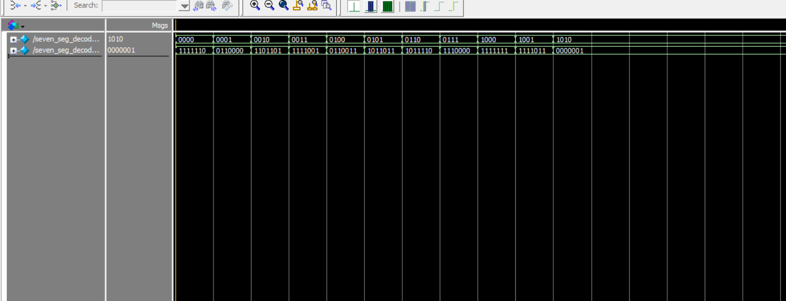

# 🔢 Verilog - Seven Segment Decoder

This project demonstrates a Verilog implementation of a **7-segment display decoder**. It converts 4-bit binary input into the corresponding 7-bit output for controlling a common cathode 7-segment display.

## Files Included

- `src/seven_seg_decoder.v` — 7-segment display decoder (Verilog module)
- `tb/seven_seg_decoder_tb.v` — Testbench for simulation
- `seven_seg_decoder.vcd` — VCD file for waveform analysis
- `monitor_log.txt` — Simulation output log (text format)
- `wave_seven_seg_decoder_tb.png` — Waveform screenshot from ModelSim
- `seven_seg_decoder.pdf` — RTL schematic generated using Quartus

## 🔧 How It Works

The decoder maps 4-bit binary values (`bin[3:0]`) to 7-segment outputs (`seg[6:0]`) corresponding to decimal digits `0–9`.

| Binary Input | Displayed Number | seg[6:0] |
|--------------|------------------|----------|
| `0000`       | 0                | `1000000` |
| `0001`       | 1                | `1111001` |
| `0010`       | 2                | `0100100` |
| ...          | ...              | ...       |
| `1001`       | 9                | `0010000` |

> 📝 Only decimal digits `0–9` are decoded. Values `10–15` (A–F) are not mapped.

## ✅ Simulation Output

📄 `monitor_log.txt` (Partial):

bin=0000(0), seg=1000000 @ 10 ns bin=0001(1), seg=1111001 @ 20 ns bin=0010(2), seg=0100100 @ 30 ns ...

## 📉 Waveform

🖼️ `wave_seven_seg_decoder_tb.png`  
Shows how binary input changes over time and how the corresponding `seg` output is updated.

## 🧠 RTL Schematic

📄 `seven_seg_decoder.pdf`  
This RTL diagram (generated by Quartus) visualizes how the module routes the binary input to 7 segment outputs based on logic conditions.

[📄 View RTL Schematic (PDF)](seven_seg_decoder.pdf)

## 📦 Tools Used

- 🛠️ **Quartus Prime** (RTL view)
- 🧪 **ModelSim** (Simulation & waveform)
- 💻 **Verilog HDL**
